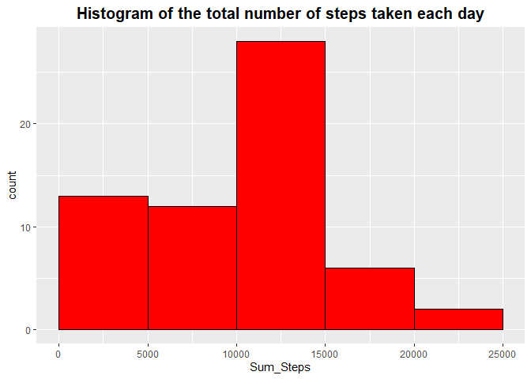
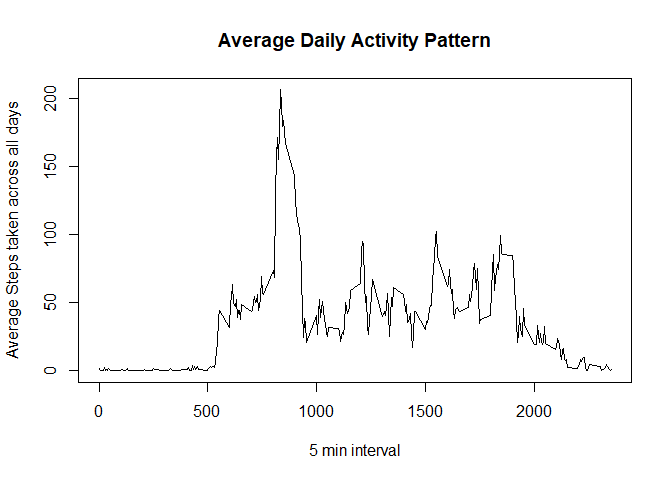
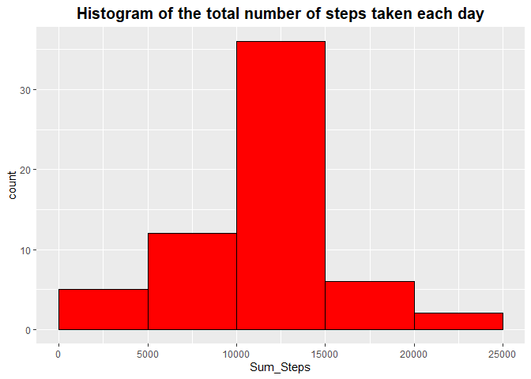
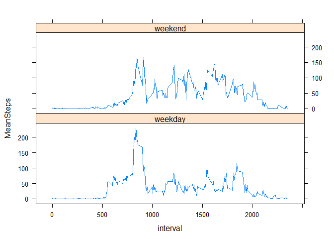

## Loading and preprocessing the data


```r
lapply(c("lubridate", "dplyr", "ggplot2", "stargazer"), require, character.only = TRUE)
unzip(zipfile = "activity.zip")
Data <- read.csv("activity.csv", header = T, )
Data$date <- ymd(Data$date)
```


## What is mean total number of steps taken per day?

For this part of the assignment, you can ignore the missing values in the dataset.

1. Calculate the total number of steps taken per day


```r
Data1 <- Data %>% 
         group_by(date) %>% 
         summarise(Sum_Steps = sum(steps, na.rm = T))
Data1
```

```
## # A tibble: 61 x 2
##    date       Sum_Steps
##    <date>         <int>
##  1 2012-10-01         0
##  2 2012-10-02       126
##  3 2012-10-03     11352
##  4 2012-10-04     12116
##  5 2012-10-05     13294
##  6 2012-10-06     15420
##  7 2012-10-07     11015
##  8 2012-10-08         0
##  9 2012-10-09     12811
## 10 2012-10-10      9900
## # ... with 51 more rows
```

2. If you do not understand the difference between a histogram and a barplot, research the difference between them. Make a histogram of the total number of steps taken each day


```r
ggplot(data = Data1, aes(x= Sum_Steps)) +
  geom_histogram(breaks=seq(0,max(Data1$Sum_Steps)+5000,5000),
                 fill="red", colour="black")+
  ggtitle("Histogram of the total number of steps taken each day") +
  theme(plot.title = element_text(face = "bold", size = (15), hjust = 0.5))
```

<!-- -->

3. Calculate and report the mean and median of the total number of steps taken per day


```r
summary(Data1$Sum_Steps)
```

```
##    Min. 1st Qu.  Median    Mean 3rd Qu.    Max. 
##       0    6778   10395    9354   12811   21194
```

<span style="color: red;">The mean total number of steps taken per day is 9354, while the median total number of steps taken per day is 10395.</span>

## What is the average daily activity pattern?

1. Make a time series plot (i.e. `type = "l"`) of the 5-minute interval (x-axis) and the average number of steps taken, averaged across all days (y-axis)


```r
Data2 <- Data %>% 
         group_by(interval) %>% 
         summarise(MeanSteps = mean(steps, na.rm = TRUE))
plot(x = Data2$interval, y = Data2$MeanSteps, type = "l", lty = 1, xlab = "5 min interval", 
     ylab = "Average Steps taken across all days", main = "Average Daily Activity Pattern")
```

<!-- -->

2. Which 5-minute interval, on average across all the days in the dataset, contains the maximum number of steps?


```r
Data2 <- Data2 %>%  
           dplyr::arrange(desc(MeanSteps))
Data2[1,]
```

```
## # A tibble: 1 x 2
##   interval MeanSteps
##      <int>     <dbl>
## 1      835      206.
```

<span style="color: red;">The 5-minute interval that has the maximum number of steps across all the days in the dataset is interval 835.</span>

## Imputing missing values

Note that there are a number of days/intervals where there are missing
values (coded as `NA`). The presence of missing days may introduce
bias into some calculations or summaries of the data.

1. Calculate and report the total number of missing values in the dataset (i.e. the total number of rows with `NA`s)


```r
summary(Data$steps)
```

```
##    Min. 1st Qu.  Median    Mean 3rd Qu.    Max.    NA's 
##    0.00    0.00    0.00   37.38   12.00  806.00    2304
```

<span style="color: red;">The total number of missing values in the dataset is 2304.</span>

2. Devise a strategy for filling in all of the missing values in the dataset. The strategy does not need to be sophisticated. For example, you could use the mean/median for that day, or the mean for that 5-minute interval, etc.

<span style="color: red;">To address this question, I have chosen to follow a two steps process whereby I first create an additional variable called intervalMean, which calculates the mean steps taken in each interval and assigns this mean values to all observations.</span>


```r
Data <- Data %>% 
        group_by(interval) %>% 
        mutate(intervalMean = mean(steps, na.rm = T))
```

<span style="color: red;">Afterwards, I have used an if statment to condtionally create a variable called stepsFull, which takes the steps value if steps is not missing and takes the intervalMean value when the steps varialbe is missing.</span>


```r
Data$stepsFull <- ifelse(is.na(Data$steps), Data$intervalMean, Data$steps)
```


3. Create a new dataset that is equal to the original dataset but with the missing data filled in.


```r
Data3 <- Data %>% 
         select(date, interval, stepsFull)
```


4. Make a histogram of the total number of steps taken each day and Calculate and report the **mean** and **median** total number of steps taken per day. Do these values differ from the estimates from the first part of the assignment? What is the impact of imputing missing data on the estimates of the total daily number of steps?


```r
Data4 <- Data3 %>% 
         group_by(date) %>% 
         summarise(Sum_Steps = sum(stepsFull, na.rm = T))

ggplot(data = Data4, aes(x= Sum_Steps)) +
  geom_histogram(breaks=seq(0,max(Data1$Sum_Steps)+5000,5000),
                 fill="red", colour="black")+
  ggtitle("Histogram of the total number of steps taken each day") +
  theme(plot.title = element_text(face = "bold", size = (15), hjust = 0.5))
```

<!-- -->

```r
summary(Data4$Sum_Steps)
```

```
##    Min. 1st Qu.  Median    Mean 3rd Qu.    Max. 
##      41    9819   10766   10766   12811   21194
```

<span style="color: red;"> With the imputed missing cases the **mean** total steps taken each day is 
10766 while the **median** total steps taken each day is 10766.</span>

## Are there differences in activity patterns between weekdays and weekends?

For this part the `weekdays()` function may be of some help here. Use
the dataset with the filled-in missing values for this part.

1. Create a new factor variable in the dataset with two levels -- "weekday" and "weekend" indicating whether a given date is a weekday or weekend day.


```r
Data3$weekendDummy <- ifelse(weekdays(Data3$date) == "Saturday" | weekdays(Data3$date) == "Sunday", "weekend", "weekday" )
```


1. Make a panel plot containing a time series plot (i.e. `type = "l"`) of the 5-minute interval (x-axis) and the average number of steps taken, averaged across all weekday days or weekend days (y-axis). The plot should look something like the following, which was created using **simulated data**:

 


```r
Data6 <- Data3 %>% 
         group_by(weekendDummy, interval) %>% 
         summarise(MeanSteps = mean(stepsFull, na.rm = TRUE))
library(lattice)
xyplot(MeanSteps ~ interval| weekendDummy, data = Data6, type = "l", layout = c(1,2))
```

<!-- -->

